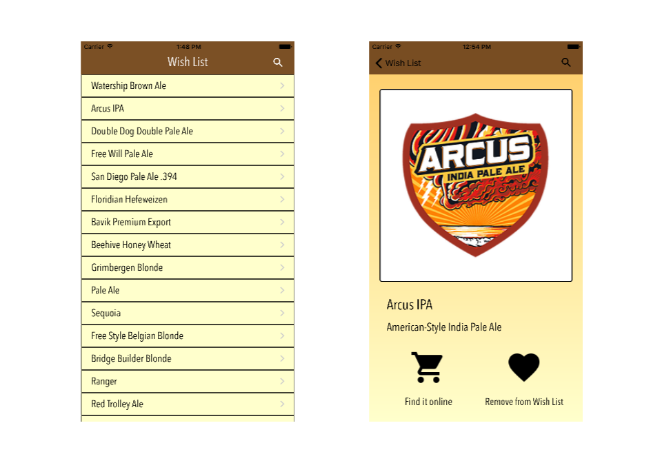

# BeerMe!

###iOS Beer Discovery App

Swipe your way to craft-beer nirvana with BeerMe!, a fun way to expand your beer-drinking palette.

The BeerMe! tech stack includes the following languages and frameworks...

####Front end:

* Swift 2.2
* Xcode 7.3.1
* AlamoFire
* MDCSwipeToView (a great framework for Tinder-style swiping)

####Back end:

* Node.js/Express
* MongoDB (mLab + Mongoose.js)
* AWS Electric Beanstalk hosting

BeerMe! uses the amazing BreweryDB API for all of its beer data. 

####How It Works

Log in, choose a style, and swipe through a continuosly-reloading assortment of beers chosen at random. 

Swipe right and the beer is added to your Wish List. Swipe left and you'll never see that beer again. (This might be tweaked in a future version. It seems a tad extreme.)

####TODO:

* Make it pretty
* Build out the "find it online" feature
* Make the front-end code (a lot) more modular
* Refactor back-end to reduce time it takes to make API calls
* Add directions for cloning & running
* Add a Contributing page 
* Add profile views, social media functionality, and lots of other fun stuff I probably don't have time for...

